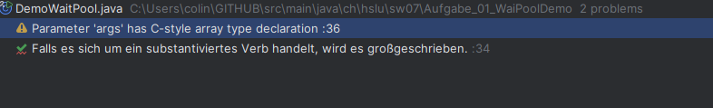

Es soll der Wait-Pool eines Objektes demonstriert werden. Die Klassen kompilieren problemlos.
Trotzdem sind sie semantisch nicht in Ordnung.

    A) Welche Anmerkungen oder Bugs macht/findet die IDE zu DemoWaitPool?

    B) Welche Anmerkungen oder Bugs macht/findet die IDE zu MyTask?
nichts
